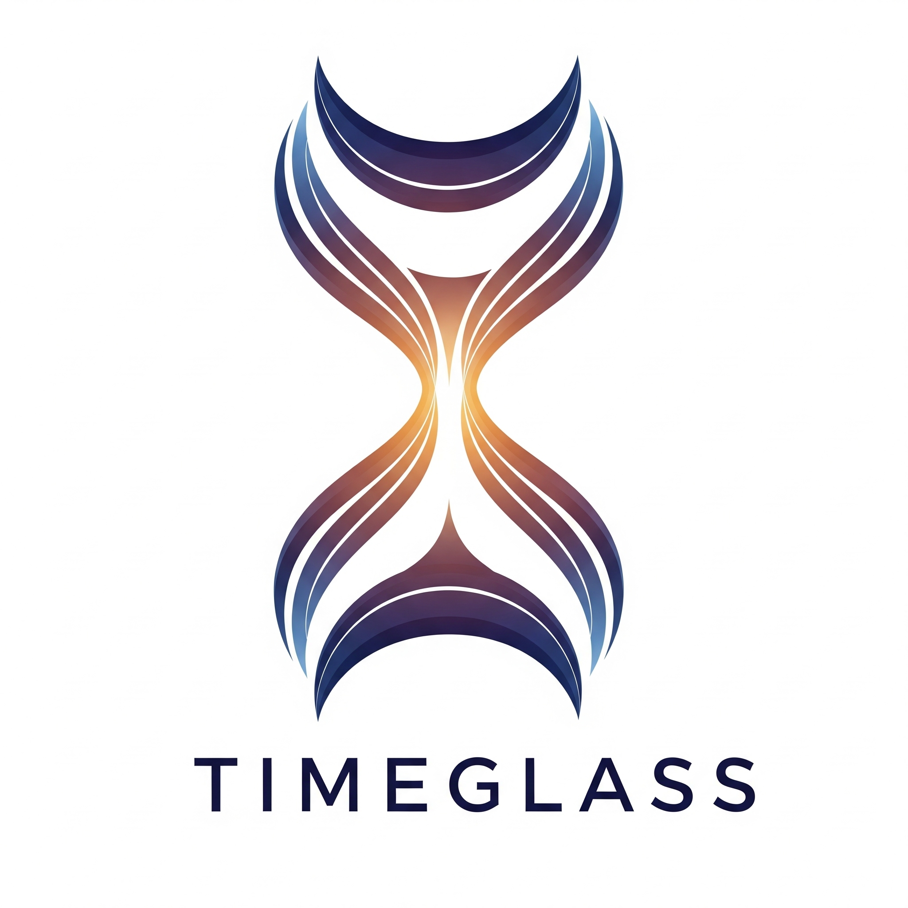

# TimeGlass


TimeGlass is a lightweight, easy-to-use profiling tool designed specifically for FastAPI applications. It provides developers with detailed insights into application performance, helping identify bottlenecks in request/response times and database queries during local development.

## Features

- **Minimal Overhead Profiling**: Rust-based engine ensures negligible impact on application performance
- **Comprehensive Metrics**: Tracks latency, throughput, CPU/memory usage, database query times, and error rates
- **Intuitive Web Dashboard**: Visual interface for analyzing request performance and bottlenecks
- **Simple CLI**: Easy-to-use command-line interface for managing the tool
- **FastAPI Integration**: Single middleware addition to start profiling

## Installation

Install TimeGlass using pip:

```bash
pip install timeglass
```

## Quick Start

### 1. Add Middleware to Your FastAPI App

Add the TimeGlass middleware to your FastAPI application:

```python
from fastapi import FastAPI
from timeglass import TimeGlassMiddleware

app = FastAPI()

# Add TimeGlass middleware
app.add_middleware(TimeGlassMiddleware)
```

### 2. Run Your Application

Start your FastAPI application as usual:

```bash
uvicorn main:app --reload
```

### 3. Launch the Dashboard

Open a new terminal and start the TimeGlass web dashboard:

```bash
timeglass ui
```

### 4. View Results

Visit `http://localhost:8000` (or the configured port) in your browser to access the TimeGlass dashboard and analyze your application's performance.

## Benchmarks

TimeGlass measures and scores your application on the following benchmarks:

### Performance Benchmarks ⚡️

- **Latency (Response Time)**:
  - Average Latency
  - p90 Latency (90th percentile)
  - p99 Latency (99th percentile)
- **Throughput**: Requests Per Second (RPS)
- **Resource Utilization**:
  - CPU Usage
  - Memory (RAM) Usage
  - Database Query Time

### Resilience Benchmarks 🛡️

- **Error Rate**: Percentage of 5xx server errors
- **Response to Bad Input**: Proper handling of invalid data with 4xx errors

### Additional Benchmarks

- **Test Coverage**: Percentage of code covered by automated tests

## Usage

### CLI Commands

- `timeglass ui`: Start the web dashboard
- `timeglass --help`: Display help information
- `timeglass --version`: Show current version

### Dashboard Features

- **Requests List**: Filterable table of recent requests with timestamp, endpoint, method, status, and duration
- **Detailed View**: In-depth analysis including timeline, database queries, flame graphs, and request context
- **Real-time Metrics**: Live updates of performance metrics as requests are processed

## Configuration

TimeGlass works out-of-the-box with sensible defaults. For advanced configuration options, refer to the documentation.

## Contributing

We welcome contributions! Please see our [Contributing Guidelines](CONTRIBUTING.md) for details on how to get started.

## Roadmap

Check out our [Roadmap](ROADMAP.md) to see planned features and improvements.

## License

TimeGlass is open source software licensed under the MIT License.

## Support

If you encounter any issues or have questions, please [open an issue](https://github.com/your-repo/timeglass/issues) on GitHub.
